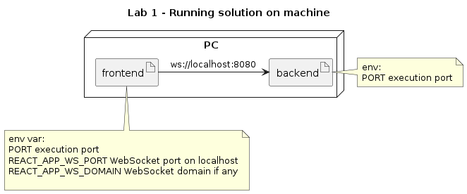
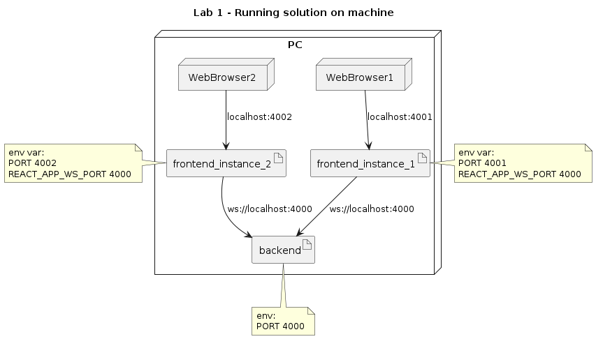

# First Lab - Create Node app and React app

In this lab, we are going to create an NodeJS that contains a Web Socket, also we are going to create a ReactJS that consumes the Web socket.

This project pretends to "simulate" a chat service that runs in localhost

## Solution diagrams



### Running example diagram


# Environment used:

* OS Name : Ubuntu 22.04.1 LTS
* OS Type : 64-bit
* GNOME Version : 42.4
* Windowing System : X11

* WebApp: ReactJS, ws
* Backend: NodeJS, ws

## Other tools needed

node, npm, create-react-app

# First lab instructions

## Installing dependencies

On git project root dir:

```Terminal
cd lab-1/backend \; npm i
cd .. \; cd ..
cd lab-1/frontend \; npm i 
```

### Running backend app

```
cd lab-1/backend \; npm start
```

### Running backend app on a different port 

```
cd lab-1/backend \; PORT=4000 npm start
```

### Running fronend app with localhost port for websocket

```
cd lab-1/frontend \; REACT_APP_WS_PORT=4000 npm start
```

### Running fronend app with localhost port for websocket and different port for webapp

```
cd lab-1/frontend \; REACT_APP_WS_PORT=4000 PORT=5000 npm start
```

# Testing multiple clients

Open 3 terminals

* On terminal 1 run backend in port 4000:
```
cd lab-1/backend \; PORT=3000 npm start
```
* On terminal 2 run frontend in port 4001:
```
cd lab-1/frontend \; REACT_APP_WS_PORT=4000 PORT=4001 npm start 
```
* On terminal 3 run frontend in port 4002:
```
cd lab-1/frontend \; REACT_APP_WS_PORT=4000 PORT=4002 npm start
```
