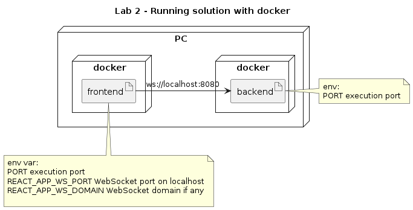
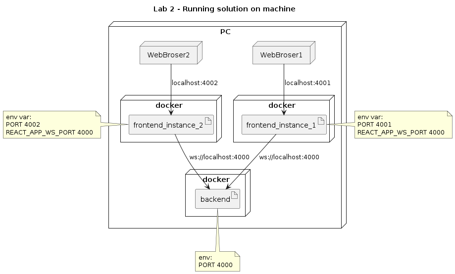

# Second Lab - Containerize Node app and React app

In this lab, we are going to containerize both apps using docker, please be aware that we are not going to apply containers for a production level/scenario. 

## Solution diagrams



### Running example diagram



## Building docker images
```
docker build -t tag_name_to_use .
```

The dot at the end of the command tells docker to use Dockerfile in the current directory. If you want to use another file you can use the -f param to set the name of the Dockerfile to use.

The -t allows to tag the docker image created for easier reference.


## Runnig docker container

### Simple running container

Command: 
```
docker run image_tag_name
```


### Running container exposing port (map to host)

Command: 
```
docker run -p HostPort:InternalPort image_tag_name
```

Example:

```
docker run -p 8080:8080 image_tag_name
```

### Running container with env var

```
docker run -e ENV_VAR_NAME=ENV_VAR_VALUE image_tag_name
```

### Running container with env var and with port

```
docker run -e PORT=InternalPort -p HostPort:InternalPort tab_image_name
```

Example:

```
docker run -e PORT=45000 -p 80:45000 image_tag_name
```

Set env var PORT to 45000 and maps container port 45000 to host port 80


# Second lab instructions

## Building docker images

### Building backend docker container

On terminal:

```
cd lab-2/backend
docker build -t chat/backend .
```

### Building frontend docker container

On terminal:

```
cd lab-2/frontend
docker build -t chat/frontend .
```
## Running docker images

On termial:

```
docker run -e PORT=4000 -p 4000:4000 chat/backend
docker run -e REACT_APP_WS_PORT=4000 -e PORT=4001 -p 4001:4001 chat/frontend
docker run -e REACT_APP_WS_PORT=4000 -e PORT=4002 -p 4002:4002 chat/frontend
```

now open 2 browser tabs and look for:
* localhost:4001
* localhost: 4002