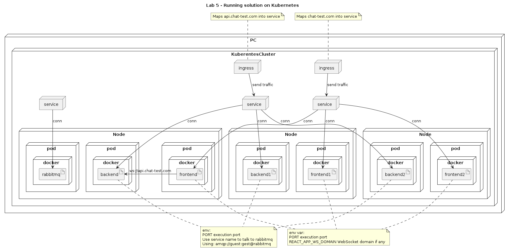

# Fifth Lab - Deploy multiple Node app, React app and RabbitMQ on Kubernetes (minikube)

In this lab, we are going to deploy both apps on a kubernetes cluster in the local machine using minikune. Each app will be deploy with 3 pod each, and they will be able to talk to each other. Also, our cluster will have 3 nodes

## Solution diagrams


### Running example diagram


# Fifth lab instructions

## Run minikube with docker driver

On terminal:

```
minikube start --driver=docker ---nodes 3
```

## Building docker images

### Building backend docker container

On terminal:

```
cd lab-5/backend
docker build -t chat/backend .
```

### Building frontend docker container

On terminal:

```
cd lab-5/frontend
docker build -t chat/frontend .
```

## Import docker images into minikube 

On terminal

```
minikube image load chat/frontend
minikube image load chat/backend
```

Note: it can take some time to load the images, let it finish

## Install minikube addons

These are the addos to be installed:
* ingress
* dashboard
* metrics-server

To install them, run on terminal:

```
minikube addons enable dashboard
minikube addons enable metrics-server
minikube addons enable ingress
```

Note: the ingress addons can take some time to be installed.

## Deploy yaml file

On terminal:

``` 
cd lab-5/deployment
kubectl create -f deployment_broker.yml
kubectl create -f deployment_frontend.yml
kubectl create -f deployment_backend.yml
```

## Get minikube cluster ip

On terminal:

```
minikube ip
```

## Add domains into hosts file

On ubuntu, open /etc/hosts file as sudo by

```
cd ; cd .. ; cd .. ; cd etc ; sudo open hosts
```

in the hosts file, add map of ip to domain.
```
Cluster-IP  domain
```

for the lab it will be:

```
ClusterIP   api.chat-test.com
ClusterIP   chat-test.com
```

For my local environment it looks like:

```
192.168.59.186  api.chat-test.com
192.168.59.186  chat-test.com
```

## Open dashboard 

on terminal:

```
minikube dashboard
```

There you can find the deployment status of each pod, service, deployment and ingress.