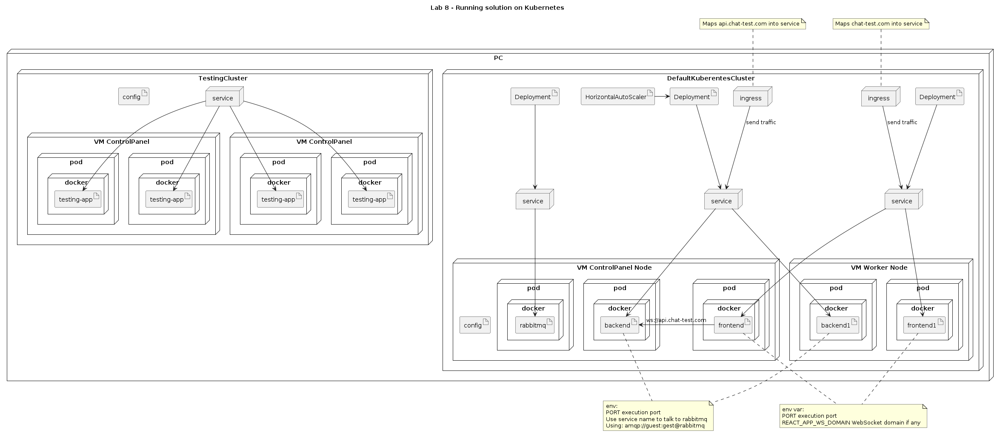

# Eighth Lab - Deploy multiple NodeJs app, ReactJs app and RabbitMQ on Kubernetes (minikube). Multi node cluster, using VirtualBox VMs. Stress test and horizontal scaling

In this lab, we are going to deploy both apps on a kubernetes cluster in the local machine using minikune. Each app will be deploy with 3 pod each, and they will be able to talk to each other. Also, our cluster will have 3 nodes.

Backend will have 10 replicas (pods), and the frontend will also have 10 replicas (pods), all of them devided evenly on the 3 VMs nodes.

We are going to create 

## Solution diagrams



### Running example diagram


# Fifth lab instructions

For this lab you may need to have enough resources to run the cluster, we are going to use 12 CPUs and 30000 Mb of disk,(by default the nodes gets 2 cpus and 2000 Mb of disk).

## Run minikube with docker driver

On terminal:

```
minikube start --driver=virtualbox ---nodes 3 --cpus 3 --memory 10000
```

## Building docker images

### Building backend docker container

On terminal:

```
cd lab-6/backend
docker build -t chat/backend .
```

### Building frontend docker container

On terminal:

```
cd lab-6/frontend
docker build -t chat/frontend .
```

## Import docker images into minikube 

On terminal

```
minikube image load chat/frontend
minikube image load chat/backend
```

Note: it can take some time to load the images, let it finish

## Install minikube addons

These are the addos to be installed:
* ingress
* dashboard
* metrics-server

To install them, run on terminal:

```
minikube addons enable dashboard
minikube addons enable metrics-server
minikube addons enable ingress
```

Note: the ingress addons can take some time to be installed.

## Deploy yaml file

On terminal:

``` 
cd lab-7/deployment
kubectl create -f deployment_config.yml
kubectl create -f deployment_broker.yml
kubectl create -f deployment_frontend.yml
kubectl create -f deployment_backend.yml
```

## Get minikube cluster ip

On terminal:

```
minikube ip
```

## Add domains into hosts file

On ubuntu, open /etc/hosts file as sudo by

```
cd ; cd .. ; cd .. ; cd etc ; sudo open hosts
```

in the hosts file, add map of ip to domain.
```
Cluster-IP  domain
```

for the lab it will be:

```
ClusterIP   api.chat-test.com
ClusterIP   chat-test.com
```

For my local environment it looks like:

```
192.168.59.186  api.chat-test.com
192.168.59.186  chat-test.com
```

## Open dashboard 

on terminal:

```
minikube dashboard
```

There you can find the deployment status of each pod, service, deployment and ingress.